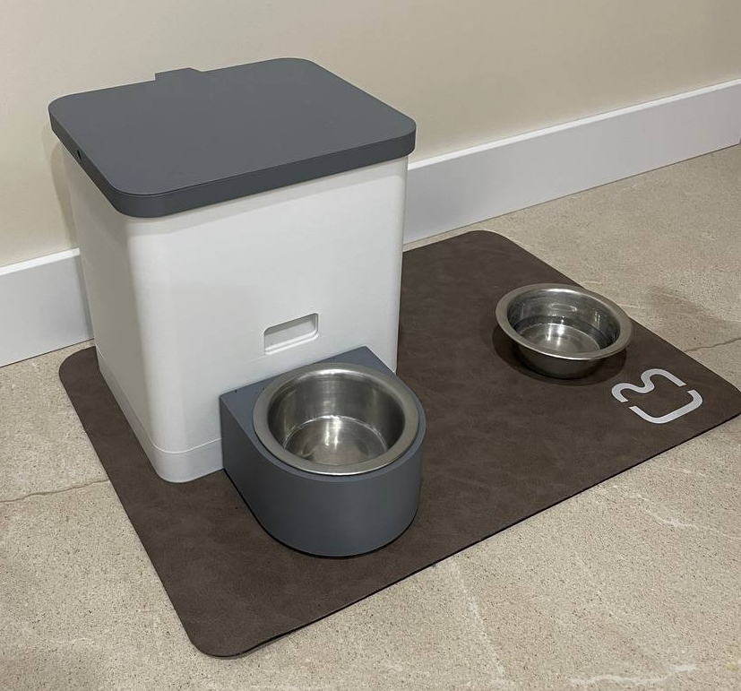

# Pet Feeder

This project allows you to build an automated pet feeder using an ESP32 microcontroller. It supports scheduled feeding based on specified times and portion weights, sends Telegram notifications about all activities, and provides updates on the device's status, including battery percentage.



[main.MOV](media/main.MOV)

## Software Instructions

### 1. Install Arduino IDE
Set up the [Arduino IDE for ESP32](https://docs.espressif.com/projects/arduino-esp32/en/latest/installing.html) by following the official instructions.

### 2. Configure Partition Scheme
In the Arduino IDE, navigate to:
- **Tools** -> **Partition Scheme** -> **Huge App**.

### 3. Define Pins Used by the Feeder
Update the pin configuration in `feeder/UsedPins.h` according to your hardware setup.

### 4. (Optional) Adjust Voltage Sensor Multipliers
To fine-tune the voltage readings for `espVoltageSensor` and `motorVoltageSensor`:
1. Use a multimeter to measure actual voltages.
2. Compare these measurements with `VoltageSensor::readVoltage`.
3. Adjust the multiplier:
   - If the multimeter reading is higher, increase the multiplier (greater than 1).
   - If it is lower, decrease the multiplier (less than 1).

### 5. Calibrate Load Cell (Step 1)
1. Open the file `additional/loadCellCalibration1` in the Arduino IDE.
2. Upload the sketch to the ESP32 and follow the Serial Monitor instructions.
3. Calculate the calibration factor using the formula:
   ```
   calibration factor = (reading) / (known weight)
   ```  
4. Save this calibration factor (e.g., `1106`).

### 6. Calibrate Load Cell (Step 2)
1. Open the file `additional/loadCellCalibration2` in the Arduino IDE.
2. Upload the sketch to the ESP32.  
   Perform this step after embedding the load cell into the 3D-printed enclosure (including the plate, but excluding the bowl).
3. Save the offset value obtained (e.g., `-62230`).

### 7. Configure Load Cell in Code
Include the retrieved calibration values in your code as follows:
```cpp
WeightSensor weightSensor(LOADCELL_DOUT_PIN, LOADCELL_SCK_PIN, 1106, -62230);
```  

### 8. Explore Additional Examples
In the `additional` folder, you’ll find example sketches for:
- **DC Motor Control**: Demonstrates how to control the motor used for dispensing food.
- **Load Cell**: Includes further examples for advanced load cell usage and testing.

Use these examples to better understand and customize specific components of the feeder.

### 9. Create a Telegram Bot
1. Open Telegram and search for **BotFather**.
2. Start a chat with **BotFather** and send the command `/newbot`.
3. Follow the instructions to set up your bot. You’ll receive a bot token upon completion.

### 10. Create a Telegram Group and Retrieve Group ID
1. Create a new Telegram group.
2. Add your bot and **@getidsbot** to the group.
3. Wait for **@getidsbot** to post a message containing the group ID. Copy the ID, then remove **@getidsbot** from the group.

### 11. Upload Code to ESP32
1. Open the main sketch for your feeder project in the Arduino IDE.
2. Connect your ESP32 to your computer via USB.
3. Select the correct **Board** and **Port** in the Arduino IDE:
   - **Tools** -> **Board** -> **ESP32 Dev Module**
   - **Tools** -> **Port** -> Select your ESP32's port.
4. Click **Upload** to flash the code onto your ESP32.

### 12. Connect ESP32 to Wi-Fi and Configure Feeder
1. When powered on, the ESP32 will broadcast an access point named **PetFeeder** with the password **11111111**.
2. Connect to this access point within 5 minutes to access the configuration portal.
3. Fill in the following details:
   - Wi-Fi credentials
   - Telegram bot token
   - Telegram group ID
   - Feeding schedule and portion weights

Once configured, the ESP32 will connect to Wi-Fi. You’ll receive a welcome message in your Telegram group either immediately upon successful connection or after the 5-minute configuration window expires.
